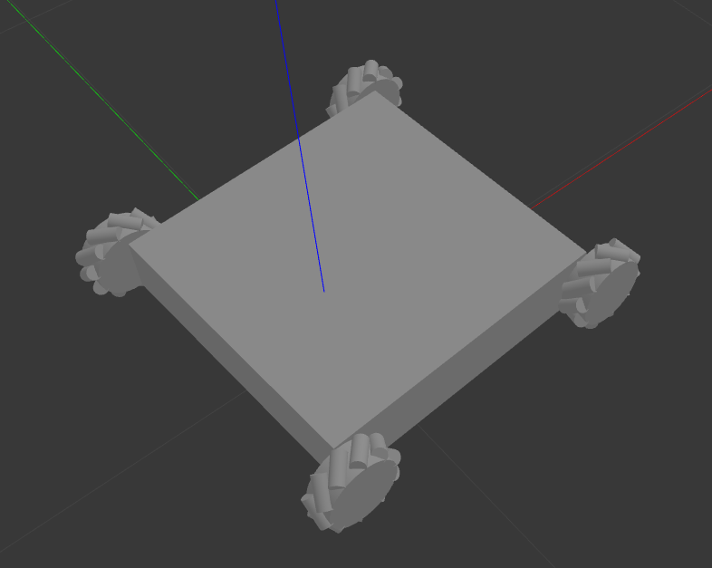
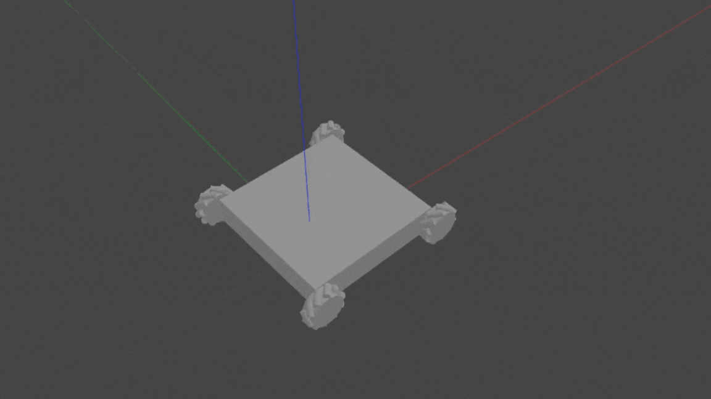

## RouteWiseAI Weekly Report 29.10.2023 / Mecanum Drive Development and Integration
- [RouteWiseAI Weekly Report 29.10.2023 / Mecanum Drive Development and Integration](#routewiseai-weekly-report-29102023--mecanum-drive-development-and-integration)
  - [Summary](#summary)
  - [Details](#details)
  - [Next Steps](#next-steps)

### Summary

This week, we made significant advancements in the development and integration of the Mecanum drive. From developing and tweaking the `mecanum_wheel.xacro` parametrically to integrating the wheels onto the robot's chassis, we've ensured the correct inclination and assembly. Additionally, we developed the teleoperation package and created a node for keyboard-based robot control. The culmination of this week's work was the development and integration of a Mecanum drive plugin for Gazebo, enabling us to control the robot's position and orientation using teleoperation.

### Details

- **Mecanum Wheel Development**: The `mecanum_wheel.xacro` was developed and refined from nothing, focusing on the rollers, geometry, inertias and other parameters. Our parametric approach allowed for efficient adjustments and fine-tuning. No mesh file is used.

  

      
      
<em>Perspective image of robot after wheel assembly.</em>

  

- **Chassis Integration**: The Mecanum wheels were successfully integrated onto the robot's chassis. Our approach ensured the correct positive and negative inclinations, all done parametrically.

- **Teleoperation Package**: The teleoperation package was created, and a node for keyboard-based control of the robot was developed. The `teleop_twist` node interprets keyboard commands into Twist messages, allowing real-time control of the robot.

- **Mecanum Drive Gazebo Plugin**: The Mecanum drive plugin for Gazebo was crafted and integrated. Through this plugin, the robot can now be controlled in the simulation environment based on the velocity of body retrieved from `/cmd_vel` topic which is published by `teleop_twist`. The integration showcased the robot's omnidirectional movement capabilities.

  

      
      
<em>Omnidirectional movement of the robot.</em>

  

### Next Steps

- **Motion Control Enhancement**: Improving the motion control and teleoperation node to provide smoother and more intuitive control of the robot.

- **Sensor Implementation**: We will commence the integration of sensors, allowing the robot to interact with its environment and gather data.

- **Visualization using RViz**: RViz will be integrated to offer visual feedback and representation of the robot and its surroundings.

- **Localization & Mapping**: The introduction of the cartographer will be initiated, allowing the robot to understand and map its environment.

The progress made this week sets the stage for an exciting phase of enhancement, integration, and exploration in the coming days.

